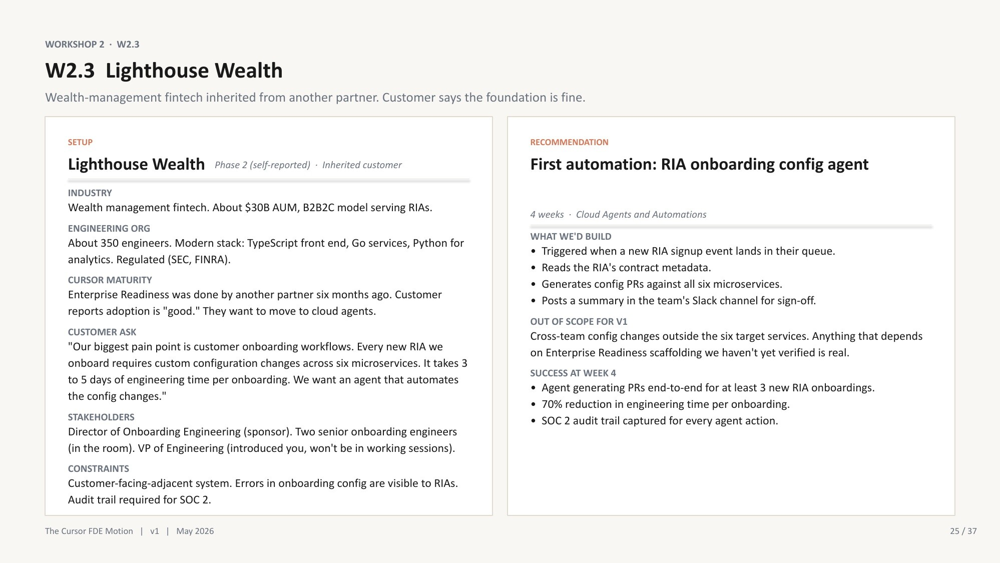

<!--
Варианты заголовка:

1. 70% accuracy может быть провалом: как выбрать первую AI automation. Cursor FDE Bootcamp, часть 2
2. Цена ошибки AI-агента: от первой automation до внутренней платформы агентов
3. От первого AI workflow до платформы агентов: практические уроки Cursor FDE Bootcamp
4. Как выбрать первую AI automation и не построить опасное demo
5. Первый агент работает. Но что именно он доказал? Cursor FDE Bootcamp, часть 2

Рабочий выбор: вариант 1. Он продолжает обещание из финала первой части, сразу дает конкретный конфликт и подводит к основной теме: выбирать и оценивать automation нужно по стоимости ошибки, а не по красивой aggregate metric.

Release checks для HTML-верстки:
- использовать полный GitHub Pages URL для ссылки на первую часть;
- преобразовать Markdown image paths для размещения HTML в `articles/`;
- проверить все изображения локально и после GitHub Pages deployment.
-->

# 70% accuracy может быть провалом: как выбрать первую AI automation. Cursor FDE Bootcamp, часть 2

Представьте: CI упал, агент разобрал логи и уверенно сказал, что это flaky test, а не настоящая regression. Еще один бессмысленный rerun, можно не отвлекать инженера на долгий разбор.

На мониторинг дашборде у этого агента уже больше 70% accuracy. Для первой версии выглядит вполне достойно. Есть понятный use case, измеримая метрика и часы ручной работы, которые эта автоматизация должна сэкономить. Можно релизить рабочий пилот проект и показывать результат?

Проблема в оставшихся ошибках. Если настоящий flake будет принят за regression, инженер потратит лишнее время. Неприятно, но переживаемо. Если же реальная regression будет помечена как flake, команда может пропустить дефект. В общей accuracy обе ошибки выглядят одинаково. Для бизнеса и production у них совершенно разная цена.

И вот это, пожалуй, лучший переход от [первой части статьи](https://eugene-burachevskiy.github.io/ai-vs-devops-blog/articles/cursor-fde-bootcamp-part-1.html) ко второй. До этого мы говорили о readiness: как понять AI maturity компании, найти bottleneck внутри SDLC и не запускать автономных агентов поверх хаоса. Допустим, эту работу мы уже сделали. Shared scaffolding появился, ownership определен, baseline собран. Теперь можно наконец что-то автоматизировать.

Но здесь появляется второй шанс все испортить.

Можно выбрать самый эффектный use case. Можно взять первую удобную метрику, поставить target и через месяц объявить пилот успешным. А можно сначала задать более неприятный вопрос: **какую ошибку этого агента мы действительно можем себе позволить?**

На Cursor FDE Bootcamp этот вопрос разбирался через workshop scenario компании Northstar Logistics. Это учебный кейс, а не публичная история реального клиента. После Enterprise Readiness - shared configuration repository уже используют 22 из 30 команд, review turnaround в сценарии сократился с 18 до 9 часов, бывшие скептики начали контрибьютить rules, а DevEx leader стал owner-ом automation roadmap.

То есть компания уже не находится в состоянии "давайте сначала научим всех пользоваться Cursor". Foundation существует, внутренние инженеры умеют его развивать, и можно выбирать первую async automation.

[](../images/cursor-fde-bootcamp/05-first-automation-training-scenario.jpg)

*Workshop scenario: after the readiness foundation is adopted, choose a first automation with bounded scope, an existing baseline, and a measurable costly-error profile. Source: Cursor FDE Bootcamp v1, May 2026.*

Выбор пал на flaky-test triage. Причины выглядят разумно: инженеры сообщают примерно о шести часах в неделю, потраченных на flakes, scope можно ограничить одним test runner, а flake-rate dashboard уже дает baseline. Первую рабочую версию реально проверить за 2–3 недели.

Первоначальный success criterion тоже кажется нормальным: не менее 70% accuracy и два DevEx инженера, которые смогут поддерживать automation. Я бы и сам несколько лет назад вполне мог принять такую метрику. Она конкретная, легко помещается в status report и позволяет показать прогресс одной цифрой.

Но сама по себе она почти ничего не говорит о безопасности решения. Нужно отдельно понять, где агент ошибается, как часто он предлагает проигнорировать реальную проблему и какой результат заставит нас немедленно отключить automation.

Поэтому во второй части я хочу разобрать уже не readiness, а сами implementation decisions:

- как выбрать первую automation по value и failure cost;
- почему overall accuracy может скрывать самый опасный тип ошибки;
- как заранее определить shutdown condition и не придумывать его после первого incident;
- где human-in-the-loop действительно защищает процесс, а где остается формальностью;
- когда достаточно event-driven Automation, а когда клиенту действительно нужен SDK или внутренняя платформа агентов.

Начнем с главного: **лучшая первая automation редко бывает самой впечатляющей. Обычно это bounded workflow, где уже есть baseline, результат можно дешево проверить, а ошибка не успеет незаметно пройти через половину компании.**

## Как выбрать первую automation

В workshop scenario у Northstar было пять кандидатов: dependency updates, flaky-test triage, переписывание PR descriptions, генерация incident runbooks и обновление API clients. Для каждого можно быстро собрать demo. Но demo отвечает только на вопрос "может ли агент один раз выполнить задачу?". Для production этого мало.

Начинать стоит не с возможностей модели, а с текущего workflow. Как часто возникает задача? Сколько дорогого ручного времени она отнимает? Можно ли ограничить первую версию одним test runner или группой репозиториев? Насколько быстро человек проверит output? И главное, какая ошибка принесет наибольший ущерб?

Хороший первый пилот обычно довольно скучный: bounded scope, известные сигналы, существующий baseline и понятный owner. Это полезнее, чем automation, которая умеет все понемногу, но после ошибки непонятно, что именно чинить: модель, context, environment или team conventions.

Кандидатов удобно прогнать через короткий scorecard:

| Критерий | Что нужно выяснить |
| --- | --- |
| Frequency и toil | Как часто запускается workflow и сколько ручного времени он отнимает? |
| Scope и baseline | Можно ли ограничить первую версию и измерить состояние до запуска? |
| Failure cost | Какая ошибка будет самой дорогой? |
| Reviewability | Может ли человек быстро проверить output? |
| Ownership | Кто будет менять и при необходимости отключать automation? |
| Next pattern | Поможет ли этот use case построить следующую automation? |

Этот scorecard нужен, чтобы вслух проговорить то, что обычно прячется за красивым demo.

И один вопрос я бы вынес отдельно:

> **Какой результат заставит нас остановить пилот и отключить automation?**

Если команда не может ответить до запуска, после первого инцидента ответ придется придумывать под давлением.

## Почему 70% accuracy может быть опасной метрикой

Вернемся к flaky-test triage. Формально агент решает classification problem, поэтому overall accuracy выглядит естественным success criterion. Но у двух типов ошибки разная цена:

| Реальное состояние | Вердикт агента | Последствие |
| --- | --- | --- |
| Flaky test | Flaky test | Экономим ручной разбор |
| Flaky test | Regression | Тратим лишнее время инженера |
| Regression | Regression | Передаем реальную проблему на разбор |
| Regression | Flaky test | Рискуем скрыть настоящий дефект |

Если flake назван regression, инженер проведет лишний разбор. Если настоящая regression названа flake, команда может сделать rerun, увидеть зеленый CI и пропустить дефект. Для accuracy это две одинаковые ошибки. Для production процесса вторая намного опаснее.

Поэтому важна precision для вердикта "это flake": когда агент предлагает проигнорировать падение, насколько часто он действительно прав? Низкий recall на первом этапе может быть приемлем. Automation сэкономит меньше времени и отправит часть flakes человеку, зато будет ошибаться в более безопасную сторону.

До выбора метрики полезно выписать confusion matrix обычными словами и спросить: что произойдет после каждого решения агента, кто заметит ошибку и можно ли отменить действие до влияния на production?

Shutdown condition можно связать с подтвержденным случаем, когда regression была помечена как flake, или с падением precision ниже согласованного threshold. Конкретные числа зависят от уверенности принятия рисков компанией. Важно определить их до запуска, назначить человека с правом остановить automation и знать, как вернуть ручной flow.

Поэтому фраза "наш агент достиг 70% accuracy" теперь вызывает у меня дополнительные вопросы. Семьдесят процентов чего? Какие ошибки попали в остальные тридцать? И что система сделала после каждого такого вердикта?

**Overall accuracy часто выбирают тогда, когда еще не оценили стоимость разных типов ошибок.**

## Anchor Bank: human-in-the-loop должен что-то значить

Следующий workshop scenario переносит нас в регулируемый банк. В Anchor Bank около 600 инженеров, Enterprise Readiness уже завершен, а rules и sub-агенты используют примерно 80% команд. То есть спорить о базовом adoption здесь уже не нужно.

Проблема находится в SOX documentation. Senior engineers тратят на нее около 20 часов в неделю: читают изменения, связывают их с business justification, описывают риски и определяют нужных reviewers.

Предложенная automation запускается при создании PR в SOX-relevant repository. Агент читает diff, commit history и связанный Jira ticket, после чего готовит draft с business justification, risk summary и reviewer routing. Затем человек редактирует документ и делает sign-off.

[](../images/cursor-fde-bootcamp/06-regulated-workflow-training-scenario.jpg)

*Workshop scenario: automate preparation of SOX change documentation while preserving human accountability for edits and approval. Productivity is not enough; the launch criteria need a quality floor and an escape hatch. Source: Cursor FDE Bootcamp v1, May 2026.*

Мне нравится, что scope сразу ограничивает полномочия агента:

- никакого auto-approval;
- никакого sign-off от имени агента;
- никакого cross-repository dependency analysis в первой версии.

На бумаге это выглядит как хороший human-in-the-loop. **Агент забирает рутинную подготовку, а ответственное решение остается у человека.** Но одного присутствия человека в схеме недостаточно.

Если reviewer получает длинный AI-generated document, не понимает, каким данным доверять, и просто нажимает approve, human-in-the-loop становится декоративным. Поэтому нужно измерять не только сэкономленные часы. Нужны quality floor, доля существенных исправлений человеком и понятный shutdown condition.

В initial proposal были три пилотных репы, цель сократить время senior engineers на 50% и получить approval формата audit trail от Compliance. Хорошее начало, но оно отвечает в основном на вопросы productivity и auditability.

А что будет, если агент несколько раз пропустит важный риск? Какое количество существенных исправлений покажет, что draft пока только добавляет review workload? Какой результат заставит Compliance остановить пилот? И есть ли среди трех репозиториев хотя бы один достаточно сложный, чтобы пилот проверял реальный workflow, а не специально выбранный happy path?

Вот здесь shutdown condition перестает быть абстрактным пунктом из governance checklist. Он может звучать примерно так: если агент пропускает risk category, которую policy требует отражать в SOX documentation, automation приостанавливается и workflow возвращается к ручному режиму до нового review. Конкретный threshold определяет сама компания, но договориться о нем нужно заранее.

Для regulated workflow я бы проверял четыре слоя:

| Слой | Что должно быть определено |
| --- | --- |
| Permissions | Какие репы и данные агент может читать, куда может писать |
| Quality floor | Какие ошибки недопустимы и сколько human corrections приемлемо |
| Accountability | Кто редактирует, подписывает и несет ответственность за результат |
| Escape hatch | Кто и при каком событии останавливает automation и возвращает manual flow |

**Human-in-the-loop защищает процесс только тогда, когда у человека есть время на проверку, достаточный контекст и право не согласиться с агентом.**

## Lighthouse Wealth: audit trail не проверяет правильность

В Lighthouse Wealth ситуация другая. Это wealth-management fintech примерно с 350 инженерами. Enterprise Readiness якобы завершил другой партнер шесть месяцев назад, adoption со слов клиента "хороший", а теперь компания хочет автоматизировать подключение новых RIA.

RIA здесь означает **Registered Investment Adviser**, зарегистрированную инвестиционно-консультационную компанию, которая будет работать через platform Lighthouse. Это не onboarding одного пользователя. Подключение каждой новой организации требует согласованных изменений в шести микросервисах и занимает 3–5 дней работы.

Идея automation выглядит очень убедительно: получить metadata нового контракта, сгенерировать configuration PRs во всех шести сервисах и отправить summary в Slack для sign-off.

[](../images/cursor-fde-bootcamp/06a-lighthouse-wealth-training-scenario.jpg)

*Workshop scenario: a new RIA onboarding event triggers configuration pull requests across six services. Inherited readiness, cross-service correctness, ownership, and auditability all need to be verified before scaling. Source: Cursor FDE Bootcamp v1, May 2026.*

Success criteria тоже звучат солидно: провести минимум три onboarding events end-to-end, сократить engineering time на 70% и сохранить SOC 2 audit trail для каждого действия агента.

Но этот scenario содержит сразу две ловушки.

Первая: **"Enterprise Readiness уже сделан" является гипотезой, а не фактом.** FDE не видел качество inherited rules, не знает, используют ли их senior engineers, и не проверял review practices. Поэтому первая неделя такого engagement должна начинаться с аудита foundation, а не с генерации PR в шести сервисах.

Вторая ловушка: audit trail показывает, что сделал агент. Он не показывает, что configuration PRs правильные.

Можно идеально записать каждый tool call, input и generated diff, а потом последовательно внести одну и ту же ошибку во все шесть сервисов. И получим, что с точки зрения auditability система прекрасна. А с точки зрения onboarding она сломана.

Значит, к success criteria нужно добавить correctness: сколько PR проходят review без существенных изменений, сколько onboarding events завершились без rollback и какие cross-service invariants проверяются до merge. Audit log нужен для расследования и compliance, но не заменяет tests и review.

Есть и organizational gap. В рабочих sessions отсутствует VP, чьи команды владеют этими шестью сервисами. Это возвращает нас к мысли из первой статьи: иногда отсутствующий stakeholder является отсутствующей системной зависимостью. Slack sign-off не спасет workflow, если у engagement нет человека с полномочиями договориться между service owners.

**Previously implemented foundation нужно проверять так же, как inherited codebase. А auditability и correctness должны иметь разные acceptance criteria.**

## Automation, SDK или платформа агентов

После нескольких таких сценариев легко прийти к противоположной ошибке: раз automation полезна, давайте сразу возьмем SDK и построим максимально гибкое решение. SDK звучит как более серьезный engineering. Но он не является продвинутой версией Automation. Это другой product surface.

Если запрос звучит как "на каждом PR", "каждое утро", "при падении CI" или "при появлении Sentry issue", скорее всего, перед нами event-driven Automation. Есть trigger, ограниченный workflow и понятный output.

SDK нужен, когда агент становится частью продукта клиента: пользователи работают с ним внутри custom UI, компании нужен контроль lifecycle и streaming, либо настоящая platform team строит shared runtime для нескольких consuming teams.

[](../images/cursor-fde-bootcamp/07-sdk-vs-automation.jpg)

*Repeated event-driven work usually begins with Automations. Use an SDK when the agent becomes part of the customer’s application or a real internal platform. Source: Cursor FDE Bootcamp v1, May 2026.*

На bootcamp было три коротких scenario, которые хорошо показывают эту границу.

### Unnamed chip-design vendor: настоящий SDK use case

Неназванный chip-design vendor встраивает Verilog-агента прямо в свой продукт. Пользователь работает с ним внутри customer-owned experience, а Cursor SDK предоставляет агентный harness. Это почти textbook example: custom UX здесь является частью самого продукта, а не красивой оболочкой поверх внутренней automation.

### Cascade Health Network: custom UI еще не делает platform

Cascade Health хочет проверять reproducibility исследовательского кода: environment pinning, deterministic seeds и data lineage. В proposal появляется custom researcher-facing UI на SDK.

Но запрос описывает gap внутри review lifecycle, а не reusable platform. А в их рабочей группе даже нет platform team. Значит, custom UI может просто съесть бюджет, не решив основную проблему. Здесь логичнее AI SDLC Integration с существующим review process и участием clinical compliance.

### Apex Trading: advanced users еще не означают platform readiness

В Apex Trading Cursor используют все 180 инженеров, компания уже прошла три engagement, а 12 strategy teams хотят свои инструменты. Кажется, что internal platform напрашивается сама.

Но platform lead отсутствует, а каждая strategy team исторически строит собственный tooling. Один SDK-агент для backtesting может отлично заработать в выбранной команде и никогда не стать общим pattern. Техническая зрелость и энтузиазм команд не создают platform operating model автоматически. Возможно, здесь нужен отдельный discovery или Strategic Build Partnership, а не обещание full scoped platform за четыре недели.

Эти примеры удобно свести к простому decision tree:

```text
Запрос начинается с "при каждом X" или "когда происходит Y"?
├── Да → Сначала Automation.
└── Нет
    ├── Агент встроен в продукт клиента и нужен custom UX?
    │   └── Да → Рассмотреть SDK.
    ├── Несколько команд строят решения на shared primitives?
    │   └── Да → Проверить platform readiness.
    └── Gap находится между стадиями SDLC?
        └── Да → Рассмотреть AI SDLC Integration.
```

Главная мысль здесь простая: **выбирайте product surface по форме workflow, а не по тому, насколько технически продвинутым он звучит.**

## Northstar шесть месяцев спустя: проверка вторым агентом

Вернемся к Northstar в последний раз. В учебном timeline прошло шесть месяцев. Flaky-test triage уже работает в production с 84% accuracy, DevEx team самостоятельно выпустила еще двух агентов для dependency updates и on-call triage, а три product teams хотят собственные решения.

Теперь запрос на внутреннюю платформу агентов выглядит совсем иначе. Он появляется не потому, что CTO увидел SDK на demo, а потому что внутри компании уже есть несколько работающих агентов, owners и consuming teams. Начинают повторяться общие задачи: authentication, logging, tracing, evaluation harness и границы ответственности между platform и product teams.

[](../images/cursor-fde-bootcamp/08-platform-readiness-training-scenario.jpg)

*Workshop scenario: an internal platform becomes credible only after the customer has independently shipped agents and multiple consuming teams need shared primitives. Source: Cursor FDE Bootcamp v1, May 2026.*

В качестве reference implementation предлагается mobile release-notes generator. Но сам reference-агент здесь не самый важный deliverable. Гораздо интереснее acceptance criteria:

- platform team самостоятельно скаффолдят второго агента;
- хотя бы один mobile engineer может расширить решение без помощи platform team;
- референсный-агент-решение используется минимум в двух mobile releases;
- ownership boundary между командами описана и проверена на практике.

Именно второй самостоятельно построенный агент является настоящим platform test. Первый мог получиться благодаря FDE, удачному demo repository и людям, которые уже знали все детали. Второй показывает, что shared primitives действительно можно переиспользовать без постоянной внешней помощи.

| Что мы утверждаем | Слабое доказательство | Сильное доказательство |
| --- | --- | --- |
| Агент работает | Один успешный demo run | Повторные production runs проходят quality gates |
| Workflow изменился | Пользователи открывали инструмент | Cycle time или manual toil меняются без потери качества |
| Мы построили platform | Есть один reusable-looking агент | Клиент самостоятельно строит и поддерживает следующего агента |

Здесь хорошо замыкается идея capability transfer из первой части. Настоящий deliverable FDE не заканчивается на working code. У клиента должен остаться owner, runbook, evaluation process, shutdown procedure и способность сделать следующее изменение без автора первой версии.

**Если клиент не может без вас построить второго агента, вы построили одного агента, а не platform.**

## Что в итоге измерять

Четыре основных сценария были про разные задачи, но паттерн оценки у них общий:

```text
Adoption signal → Engineering outcome → Business outcome → Capability transfer
```

Для flaky-test triage недостаточно посчитать runs. Нужно видеть безопасную precision, сокращение debugging toil и DevEx engineers, которые управляют automation.

Для SOX documentation недостаточно измерить сэкономленные часы. Нужны quality floor, human accountability и approval от Compliance.

Для RIA onboarding недостаточно полного audit trail. Нужны корректные cross-service PRs, реальное сокращение lead time и service owners, согласные поддерживать workflow.

Для internal platform недостаточно одного reference-агента. Platform team должна самостоятельно построить следующий, а consuming team должна уметь его расширить.

При этом **на итоговом dashboard должна быть хотя бы одна метрика, которую агент способен ухудшить**. Иначе dashboard почти гарантированно будет показывать только активность и экономию, но не риски.

## Вместо заключения: какой результат остается после FDE

В первой части мы начинали с компании, которая хотела быстро показать Cloud-агентов совету директоров. Там правильным решением было не спешить с autonomy и сначала построить capability.

Во второй части foundation уже готов. Но этого оказалось недостаточно. Можно выбрать неправильный use case, оптимизировать удобную accuracy, сделать human review формальностью или построить SDK solution там, где хватило бы Automation.

Для меня главный урок всех этих workshop scenarios в том, что production AI integration начинается не с выбора модели и даже не с архитектуры агента. Сначала нужно определить цену ошибки, способ проверки и человека, который имеет право сказать "стоп". Затем выбрать самый простой product surface, который решает конкретный workflow. И только после этого думать о масштабировании.

[](../images/cursor-fde-bootcamp/09-customer-ownership.jpg)

*The durable result is not a custom artifact. It is a system fitted to the customer’s stack, built with their engineers, and owned by them after handoff. Source: Cursor FDE Bootcamp v1, May 2026.*

Первый агент доказывает, что технология может работать. Второй агент, построенный, запущенный и улучшенный самим клиентом, доказывает, что engagement сработал.

**Настоящий deliverable FDE - это независимость клиента.**

Успешного вам опыта интеграций!

Ну и подписывайтесь на мой телеграм канал: https://t.me/ai_vs_devops
