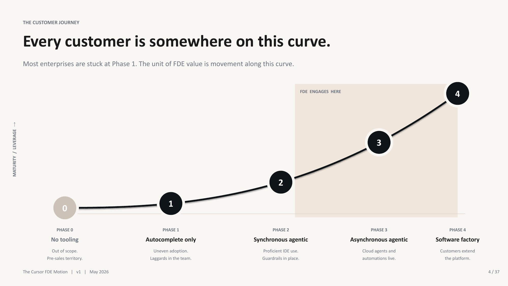
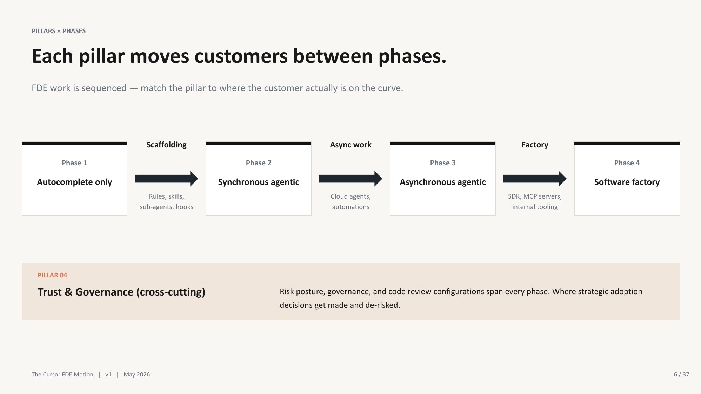
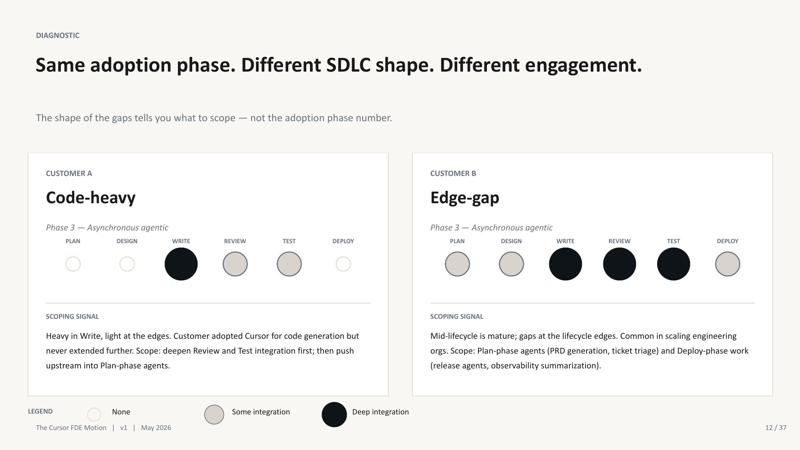
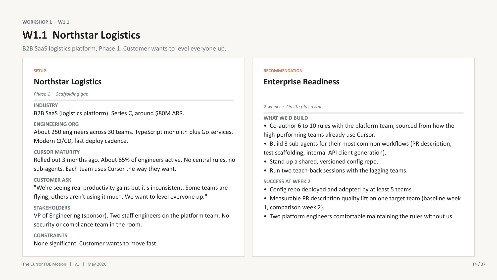
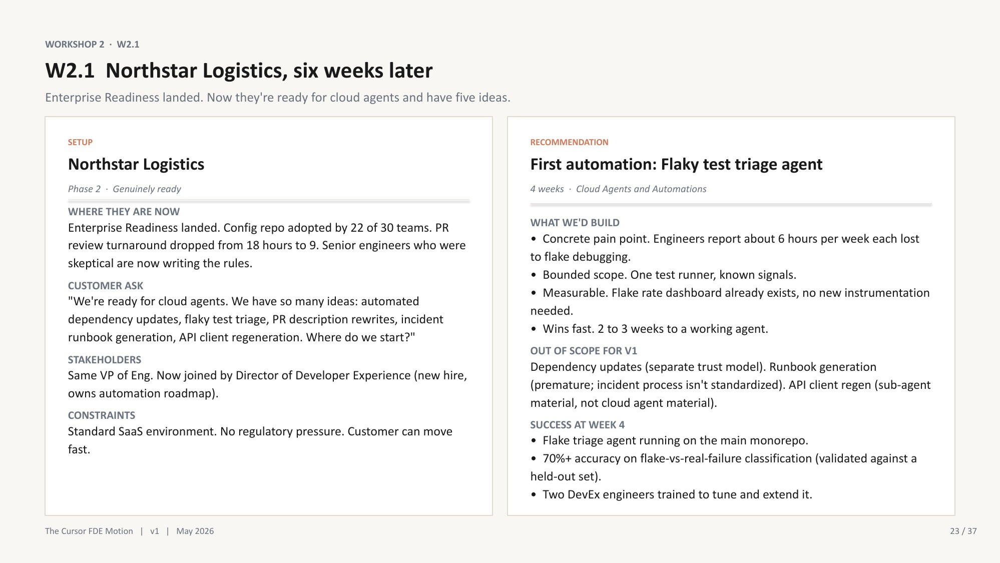
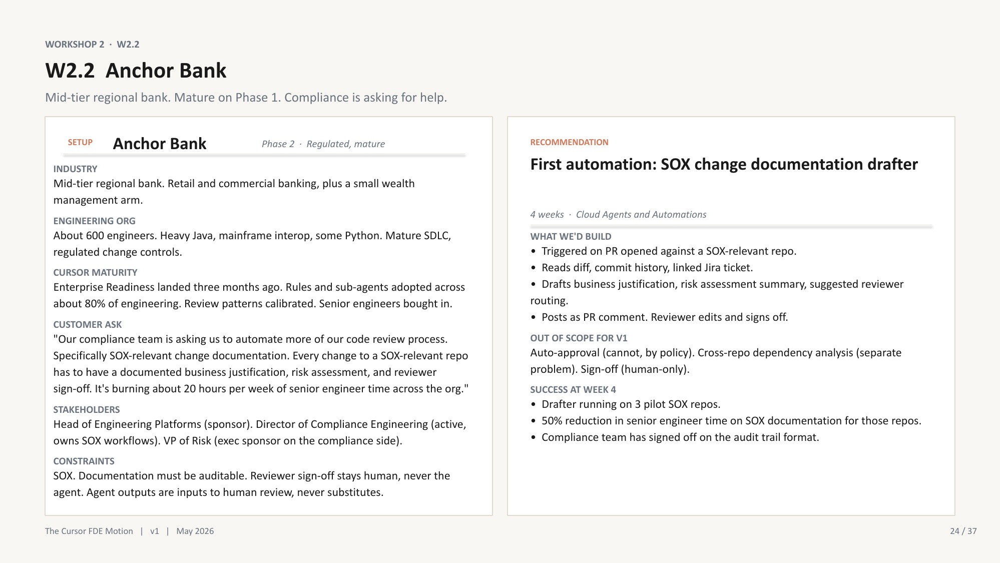
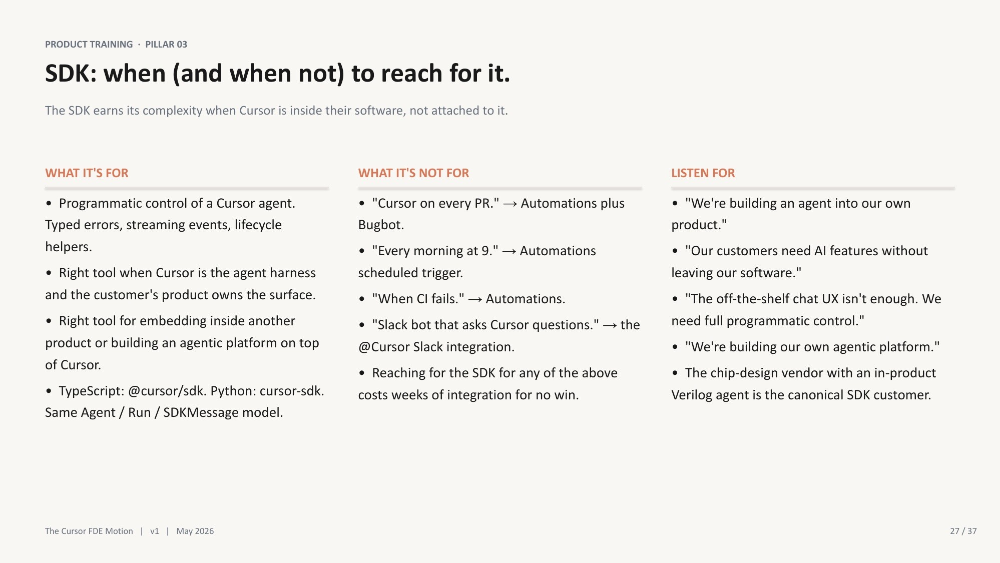
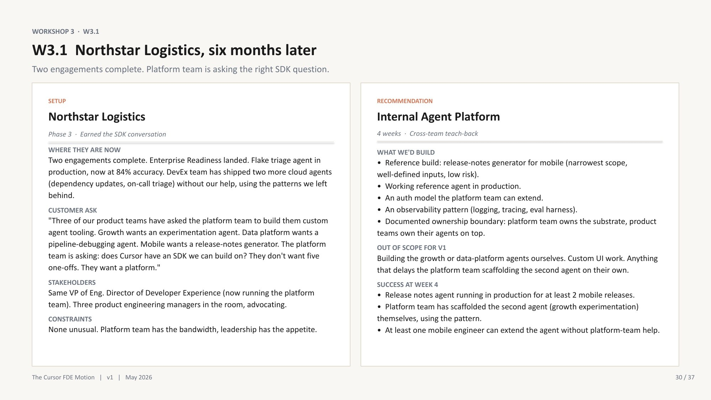
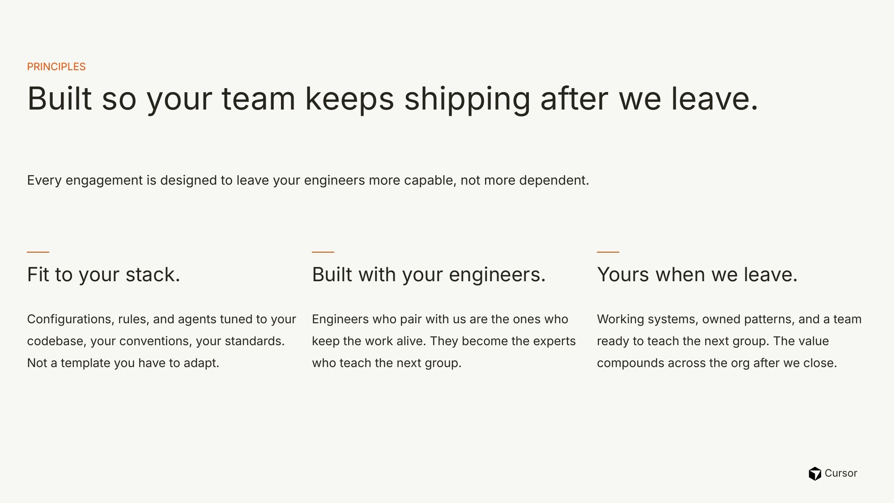

# Article Plan: Cursor FDE Bootcamp — The Hard Part Was Not Coding

> **Status:** English editorial blueprint for a future Russian-language article  
> **Format:** Personal retrospective + practical field guide  
> **Target length:** 3,500–4,500 Russian words / 14–18 minutes  
> **Primary category:** AI-Assisted Development  
> **Secondary themes:** enterprise AI adoption, platform engineering, change management, governance, evaluation  
> **Source deck:** Cursor FDE Bootcamp v1, May 2026

---

## 0. Editorial Direction

### Recommended title

**Cursor FDE Bootcamp: The Hard Part Was Not Coding**

Suggested direction for the Russian title:

**Cursor FDE Bootcamp: The Hardest Part Was Not Writing Code**

### Strong alternative titles

1. **You Did Not Build an AI Platform If the Second Agent Still Needs a Consultant**
2. **Why Enterprise Teams Ask for AI Agents Before They Are Ready for Them**
3. **From Expensive Autocomplete to an AI Software Factory: Lessons from Cursor FDE Bootcamp**
4. **The FDE’s Real Deliverable Is Customer Independence**
5. **60% Adoption, Zero Impact: What Enterprise AI Rollouts Get Wrong**

### Recommended subtitle

**What the training taught me about discovering the real bottleneck, rejecting premature automation, measuring costly failures, and leaving a customer able to ship without you.**

### Central thesis

> **A Forward Deployed Engineer does not deliver an agent. An FDE moves a customer to the next sustainable level of AI adoption—and proves that the customer can continue without the FDE.**

### Reader promise

By the end of the article, an engineer should be able to:

- distinguish tool rollout from real adoption;
- diagnose AI maturity separately from SDLC coverage;
- recognize when an “agent project” is actually a scaffolding, governance, or ownership problem;
- choose a first automation by failure cost rather than demo value;
- distinguish an Automation, an SDK integration, and an internal agent platform;
- define success in terms of capability transfer, not activity;
- use a compact discovery and engagement checklist in their own organization.

### What this article should not become

- A review of Cursor features.
- A chronological recap of 59 slides.
- Another tutorial about `.cursor/rules` or prompt writing.
- A promotional “ten lessons learned” list.
- A set of supposed customer-success stories. The named organizations in the deck appear to be synthetic, composite, or anonymized workshop scenarios.
- A claim that one maturity model fits every enterprise.

### Editorial voice

Use the personal, candid tone of the Russian tutorial articles, but the evidence discipline and production framing of the newer English deep dives.

Recommended voice:

- first person for what surprised you and how your thinking changed;
- direct second person for practical guidance;
- short paragraphs;
- one sharp claim per section;
- technical terms in English where Russian translation would be awkward;
- acknowledge where a case is a workshop exercise rather than an observed production result.

---

## 1. Cold Open — “The Customer Asked for Cloud Agents. The Correct Answer Was No.”

### Purpose

Start with a decision under pressure, not with a definition of FDE or praise for the course.

### Opening hook

Use the Meridian Health accreditation exercise as an explicitly labeled **training scenario**:

- 4,000 engineers;
- Cursor adoption reached 60% in the first month, then stayed flat for five months;
- PR velocity did not improve;
- review cycles still took 4–5 days;
- the CTO wanted cloud agents demonstrated to the board in five weeks;
- 15 senior engineers wanted SDK access;
- security was already concerned about agents touching production.

Then ask:

> What should an FDE build first?

The tempting answers are Cloud Agents or an SDK platform. The better answer is to challenge the premise: the company has no shared configuration foundation, no evidence of workflow improvement, and a review bottleneck that more generated PRs may make worse.

### Suggested first three paragraphs

1. “I expected the Cursor FDE Bootcamp to teach advanced AI implementation. It did—but the most useful exercise started with a recommendation not to implement the thing the customer requested.”
2. Present the scenario and board deadline.
3. Deliver the reframe: **the customer did not have an agent deficit; it had an adoption-system deficit.**

### Personal material to add

- What did you expect before the training?
- At what moment did the course stop feeling like product enablement and start feeling like systems engineering?
- Which recommendation did you initially choose for Meridian, and what made you reconsider it?

### Hot takes

- **The first FDE skill is not building quickly. It is refusing to build the wrong thing quickly.**
- **More AI-generated PRs do not fix a review queue. They pour fuel on it.**
- **A board demo can be technically real and organizationally fake.**

### Transition

“To understand why ‘no’ can be the most technical answer, we need to define what an FDE actually ships.”

### Image 1 — Adoption maturity curve

[](../images/cursor-fde-bootcamp/01-adoption-maturity-curve.jpg)

*Draft caption: AI adoption is a progression from isolated tool use to a customer-owned software factory. The FDE’s job is to create sustainable movement, not activity inside one phase. Source: Cursor FDE Bootcamp v1, May 2026; publication permission required.*

**Why here:** It turns the opening scenario into a general model immediately.

---

## 2. FDE Is Adoption Engineering, Not Implementation Contracting

### Purpose

Define FDE by the change left behind, not by a job-title comparison.

### Section hook

> **The artifact is not the product of an FDE engagement. The customer’s new capability is.**

### Core points

An FDE combines several roles:

- **Discovery:** find the workflow where AI can create measurable value.
- **Sequencing:** decide which capability the organization can sustain next.
- **Engineering:** ship a bounded working implementation in weeks, not quarters.
- **Governance:** make permissions, auditability, quality floors, and shutdown conditions concrete.
- **Change management:** build with internal engineers and turn skeptics into contributors.
- **Capability transfer:** ensure the customer can operate, modify, and extend the work.
- **Product feedback:** identify which custom patterns deserve to become reusable product primitives.

Contrast FDE with:

| Role | Typical success signal | Why it is insufficient for FDE work |
|---|---|---|
| Solution engineering | The demo proves the product can work | It may not survive contact with the customer’s workflow or organization |
| Consulting | The recommendation and deliverables are complete | The customer may remain dependent on the consultant |
| Staff augmentation | More implementation capacity | It does not necessarily change the customer’s operating model |
| Product engineering | A scalable general feature ships | It may not solve one customer’s urgent zero-to-one problem |
| Forward Deployed Engineering | The customer achieves a measurable outcome and can repeat the pattern alone | This is the target |

### Cool thoughts

- **Executive sponsorship is part of the architecture.** A technically correct cross-team system without decision authority is incomplete.
- **The org chart is part of the system design.** Repositories, networks, compliance boundaries, and ownership boundaries all determine scope.
- **“Build with, not for” is not a workshop slogan. It is a production-readiness mechanism.**

### Reader artifact: the FDE outcome test

Before accepting an engagement, ask:

1. What new thing will the customer be able to do after we leave?
2. Who will own it?
3. What will prove it changed a workflow rather than produced a demo?
4. Can the customer build the next instance without us?

### Image 2 — Pillars across maturity

[](../images/cursor-fde-bootcamp/02-pillars-across-maturity.jpg)

*Draft caption: Scaffolding enables consistent synchronous work; async capabilities enable automation; platform primitives enable a software factory. Trust and governance cut across every stage. Source: Cursor FDE Bootcamp v1, May 2026; publication permission required.*

### Transition

“But a maturity level alone still does not tell you what to build.”

---

## 3. Diagnose on Two Axes: Adoption Maturity and SDLC Shape

### Purpose

Introduce the most reusable framework in the training.

### Section hook

> **Two customers can have the same Cursor adoption rate and need completely different engagements.**

### Axis A — What can the organization sustain?

Avoid relying heavily on phase numbers because the memo and deck number them differently. Use descriptive stages:

1. No meaningful AI-assisted workflow.
2. Uneven autocomplete and isolated power users.
3. Proficient synchronous agentic development with shared patterns.
4. Asynchronous agents and workflow automations.
5. A customer-owned internal AI platform or software factory.

Questions to ask:

- Is usage isolated or standardized?
- Do teams share versioned rules, skills, sub-agents, hooks, and policies?
- Are review and test practices calibrated?
- Is asynchronous work already operating safely?
- Can an internal platform team own and extend the system?

### Axis B — Where is AI embedded?

Map AI coverage across:

**Plan → Design → Write → Review → Test → Deploy**

A company can be strong in Write and weak everywhere else. Another can have solid Review/Test automation but no planning or deployment integration. Their adoption label may match, but their bottlenecks do not.

### Practical diagnostic table

| Question | Weak answer reveals | Likely next intervention |
|---|---|---|
| How do your best teams use AI differently? | No shared operating pattern | Scaffolding / Enterprise Readiness |
| Where does work wait longest? | A downstream queue or approval bottleneck | Review, testing, or SDLC integration |
| Which failures are expensive? | Missing risk model | Governance and eval design |
| Who can change cross-team practice? | Missing authority | Discovery before implementation |
| Who owns the result after week four? | Dependency on the FDE | No-go until ownership is named |

### Hot takes

- **Active seats measure product access, not organizational adoption.**
- **“Our engineers use AI” is as incomplete as “our servers use Linux.”**
- **Maturity determines what a customer can sustain; SDLC shape determines where to intervene.**

### Image 3 — Same maturity, different SDLC shape

[](../images/cursor-fde-bootcamp/03-same-maturity-different-sdlc.jpg)

*Draft caption: A code-heavy customer and an edge-gap customer may sit at the same adoption stage while requiring different work. Adoption maturity and lifecycle coverage are independent dimensions. Source: Cursor FDE Bootcamp v1, May 2026; publication permission required.*

### Transition

“The first practical consequence of this model is uncomfortable: most enterprises asking for agents should begin with scaffolding.”

---

## 4. Scaffolding Before Autonomy: Do Not Automate Inconsistency

### Purpose

Show why foundations are not bureaucracy and how an FDE derives them from real teams.

### Section hook

> **Cloud agents on unstable engineering practices do not remove inconsistency. They automate it.**

### Training scenario: Northstar Logistics

Label this clearly as a workshop scenario, not a verified customer story.

Starting state:

- approximately 250 engineers across 30 teams;
- approximately 85% “active” Cursor use;
- no central rules or sub-agents;
- large differences between teams.

The proposed two-week readiness engagement:

- observe the strongest teams rather than write standards from theory;
- co-author 6–10 high-leverage rules;
- create three narrow sub-agents for PR descriptions, test scaffolding, and internal API client generation;
- store the configuration in a shared, versioned repository;
- run teach-back sessions;
- leave two platform engineers able to maintain the system.

### The important correction

“Improve PR-description quality” is too fuzzy and gameable. Better signals include:

- review turnaround;
- first-pass review acceptance;
- adoption by target teams;
- customer engineers contributing and modifying rules;
- a named leader accountable for rollout after the engagement.

### Compare with the healthcare scenario

A healthcare workshop case appears to ask for cloud agents against a 400-PR backlog. Yet most engineers have never used Cursor, governance is missing, and clinical leadership is skeptical.

The correct lesson is not “deploy in the VPC.” It is:

> **A sophisticated automation request can be a foundational adoption problem in disguise.**

### Reader artifact: readiness checklist before async agents

- Observe power users doing real work.
- Extract 3–5 repeatable practices.
- Encode them as versioned technical assets.
- Define contribution and review ownership.
- Establish quality and review baselines.
- Name the accountable engineering leader.
- Include respected skeptics in authoring and teach-back.
- Verify that downstream review capacity can absorb increased output.

### Personal material to add

- Which scaffolding element looked “basic” before the bootcamp but now looks architectural?
- Did the exercises change how you view `.cursor/rules`, skills, hooks, or shared configuration repositories?
- Which skeptic or stakeholder would you invite into the working group first, and why?

### Image 4 — Readiness scenario

[](../images/cursor-fde-bootcamp/04-readiness-training-scenario.jpg)

*Draft caption: Workshop scenario: high seat activity without shared scaffolding is still an early-stage adoption problem. A bounded engagement creates shared patterns, ownership, and measurable workflow change. Source: Cursor FDE Bootcamp v1, May 2026; scenario status and publication permission must be confirmed.*

### Transition

“Once the foundation is real, the next question is not ‘what can we automate?’ but ‘which mistake can we afford?’”

---

## 5. Choose the First Automation by the Cost of Being Wrong

### Purpose

Turn the automation examples into a reusable selection and evaluation framework.

### Section hook

> **The best first automation is rarely the most impressive. It is the one with bounded inputs, observable outcomes, cheap review, and survivable failure modes.**

### Training scenario A: flaky-test triage

Six weeks after the Northstar readiness exercise:

- the shared config repository is used by 22 of 30 teams;
- review turnaround moves from 18 hours to 9 hours;
- former skeptics contribute rules;
- a DevEx leader owns the automation roadmap.

The first candidate is flaky-test triage because:

- engineers report losing about six hours per week to flakes;
- one test runner creates a bounded scope;
- a flake-rate dashboard already provides instrumentation;
- a working version appears possible in 2–3 weeks.

The trap: measuring only overall classification accuracy.

A false “this is a flake” can hide a real regression. The gating metric should therefore focus on the dangerous error—for example, precision when the agent dismisses a failure as flaky—not whatever aggregate number looks best on a dashboard.

### Training scenario B: SOX documentation drafting

In a regulated-bank scenario, the agent:

1. reads the diff, commit history, and linked Jira issue;
2. drafts business justification, risk summary, and reviewer routing;
3. posts the result for human editing and sign-off.

Explicit exclusions matter:

- no auto-approval;
- no agent sign-off;
- no cross-repository dependency reasoning in v1.

The key insight:

> **In regulated software, the best first use of AI may be drafting evidence for accountable human judgment—not replacing the judgment.**

### Comparison table

| Candidate | Value | Costly failure | Better launch gate |
|---|---|---|---|
| Flaky-test triage | Less debugging toil | A real regression is dismissed as a flake | High precision on “safe to dismiss,” with manual override |
| SOX documentation drafter | Less senior-engineer documentation time | Incorrect risk narrative is rubber-stamped | Quality floor, human sign-off, approved audit trail, shutdown condition |
| Cross-service config PR generator | Faster customer onboarding | Incorrect configuration across services | PR correctness plus lead-time reduction, not auditability alone |

### Reader artifact: first-automation scorecard

Score each candidate from 1–5:

1. Frequency
2. Human toil
3. Scope boundedness
4. Existing instrumentation
5. Failure cost
6. Human reviewability
7. Time to first value
8. Named ownership
9. Permission level required
10. Reusability as the next pattern

Add one mandatory free-text question:

> **What result would make us shut this automation down?**

### Hot takes

- **Overall accuracy is often the metric you choose when you have not priced the errors.**
- **An audit trail proves what the agent did. It does not prove the result was correct.**
- **Human-in-the-loop is meaningless unless the human has time, authority, and a clear reason to disagree.**

### Image 5 — First automation

[](../images/cursor-fde-bootcamp/05-first-automation-training-scenario.jpg)

*Draft caption: Workshop scenario: after the readiness foundation is adopted, choose a first automation with bounded scope, an existing baseline, and a measurable costly-error profile. Source: Cursor FDE Bootcamp v1, May 2026; scenario status and publication permission must be confirmed.*

### Image 6 — Regulated workflow

[](../images/cursor-fde-bootcamp/06-regulated-workflow-training-scenario.jpg)

*Draft caption: Workshop scenario: automate preparation of SOX change documentation while preserving human accountability for edits and approval. Productivity is not enough; the launch criteria need a quality floor and an escape hatch. Source: Cursor FDE Bootcamp v1, May 2026; scenario status and publication permission must be confirmed.*

### Transition

“Good evaluation prevents a bad automation. Good scoping prevents the wrong product surface.”

---

## 6. Automation, SDK, or Platform? Listen to the Shape of the Request

### Purpose

Give readers an immediately actionable architecture decision rule.

### Section hook

> **An SDK is not the ‘advanced’ version of an Automation. It solves a different class of problem.**

### Decision rule

Use managed trigger-based Automation when the requirement sounds like:

- on every pull request;
- every morning;
- when CI fails;
- when a Sentry issue arrives;
- post the result to Slack;
- run the same bounded workflow repeatedly.

Reach for an SDK when:

- AI is embedded inside the customer’s own application;
- end users interact with the agent without leaving that application;
- a custom user experience is essential;
- full lifecycle or streaming control is required;
- an actual internal platform team is building reusable infrastructure for multiple consuming teams.

Consider broader AI SDLC integration when the customer describes lifecycle gaps across Plan, Design, Test, or Deploy rather than a reusable runtime platform.

### Decision tree

```text
Does the request begin with “on every X” or “when Y happens”?
├── Yes → Start with managed Automation.
└── No
    ├── Is the agent embedded in the customer’s product or custom UX?
    │   ├── Yes → Consider SDK.
    │   └── No
    │       ├── Are multiple teams building agents on shared primitives?
    │       │   ├── Yes → Evaluate internal-platform readiness.
    │       │   └── No → Scope a narrow workflow integration first.
    │       └── Are the gaps spread across SDLC stages?
    │           └── Yes → Consider AI SDLC Integration, not an SDK project.
```

### Platform readiness test

Before calling the work an internal agent platform, verify:

- a platform team exists;
- its leader is present and has capacity;
- 2–3 consuming teams are already identified;
- authentication, observability, evaluation, and governance are in scope;
- a consuming team can extend the reference agent;
- the platform team can build the second agent without the FDE.

### Hot takes

- **Customer excitement about the SDK is not platform readiness.**
- **A custom UI can consume the budget while leaving the real lifecycle gap untouched.**
- **The absence of a platform team is not a minor stakeholder omission. It changes the architecture.**

### Image 7 — SDK versus Automation

[](../images/cursor-fde-bootcamp/07-sdk-vs-automation.jpg)

*Draft caption: Repeated event-driven work usually begins with Automations. Use an SDK when the agent becomes part of the customer’s application or a real internal platform. Source: Cursor FDE Bootcamp v1, May 2026; product details must be revalidated and publication permission obtained.*

### Transition

“Choosing the right tool avoids wasted engineering. Choosing the right proof avoids a platform-shaped demo.”

---

## 7. The Second-Agent Test: Demo, Product, or Platform?

### Purpose

Deliver the article’s strongest technical and organizational criterion.

### Section hook

> **If the customer cannot build the second agent without you, you built one agent—not a platform.**

### Training scenario: six months later

In the final Northstar workshop stage:

- a flaky-test agent is already in production;
- the DevEx team independently shipped dependency-update and on-call-triage agents;
- several product teams now request custom agents;
- the next engagement proposes shared authentication, logging, tracing, evaluation, and ownership boundaries.

The reference implementation matters less than the capability-transfer tests:

- can the platform team scaffold a second agent independently?
- can a product engineer extend an agent without platform-team handholding?
- can teams observe, evaluate, and govern it?
- are platform and product-team responsibilities explicit?

### Three levels of proof

| Claim | Weak proof | Strong proof |
|---|---|---|
| “The agent works” | One staged demo succeeds | Repeated production runs meet quality and cost gates |
| “The workflow changed” | People opened the tool | Cycle time, queue size, or expensive toil changes without quality loss |
| “We built a platform” | One reusable-looking agent exists | The customer independently builds and operates the next agent |

### Reader artifact: capability-transfer acceptance criteria

Include these alongside technical acceptance criteria:

- named operational owner;
- runbook and shutdown procedure;
- customer engineer changes a rule or integration during the engagement;
- customer team performs the final demo;
- one extension is implemented without the FDE driving;
- the next use case is scoped before handoff;
- a 30/60/90-day ownership plan exists.

### Image 8 — Platform readiness scenario

[](../images/cursor-fde-bootcamp/08-platform-readiness-training-scenario.jpg)

*Draft caption: Workshop scenario: an internal platform becomes credible only after the customer has independently shipped agents and multiple consuming teams need shared primitives. Source: Cursor FDE Bootcamp v1, May 2026; scenario status and publication permission must be confirmed.*

### Transition

“This changes what ‘success’ means for the whole engagement.”

---

## 8. Measure the Chain: Adoption Signal → Engineering Outcome → Business Outcome

### Purpose

Consolidate the measurement lessons and connect them to the blog’s existing production-AI themes.

### Section hook

> **Seat count is not ROI. Agent runs are not ROI. Developer confidence is not ROI.**

### Measurement stack

A serious engagement should define:

#### Baseline

- review turnaround;
- first-pass acceptance;
- hours of expensive toil;
- onboarding lead time;
- queue size;
- error distribution;
- escaped defects.

#### Adoption signal

- target teams use the workflow repeatedly;
- reviewers interact with outputs rather than ignore them;
- internal engineers contribute changes;
- ownership is active, not nominal.

#### Engineering outcome

- less review delay;
- lower maintenance toil;
- shorter release or onboarding cycle;
- no degradation in quality.

#### Quality floor

- dangerous-error precision/recall;
- output correctness;
- audit completeness;
- maximum acceptable defect escape;
- explicit shutdown threshold.

#### Business outcome

- faster customer onboarding;
- reduced compliance effort;
- more reliable releases;
- lower operational load;
- shorter time to value.

#### Capability transfer

- named owner;
- trained operators;
- next implementation completed without external dependence.

### Cool thoughts

- **AI often moves the bottleneck instead of removing it.** Faster code generation can expose review, test, deployment, or decision latency.
- **The easiest metric to collect is rarely the one that should gate launch.**
- **A productivity gain without a quality floor is an invitation to hide expensive errors.**
- **The final dashboard should contain at least one metric the agent can make worse.**

### Internal links for the final article

- Harness engineering: `advanced-llm-ai-engineering-may-2026.html#harness`
- Evals: `advanced-llm-ai-engineering-may-2026.html#evals`
- Cost per business action: `advanced-llm-ai-engineering-may-2026.html#cost`
- Guardrails: `advanced-llm-ai-engineering-may-2026.html#guardrails`
- Spec-driven artifacts: `spec-driven-development-part1.html`
- Reusable Cursor workflows: `cursor-commands-boost.html`
- Handoff clarity over abstraction: `kiss-vs-dry-iac.html`

### Optional evidence sidebar

The deck references research in which experienced developers were measured as slower while believing they were faster. If retained, cite the original METR study and preserve its population, repository conditions, model/tool versions, publication date, confidence intervals, and limitations. Do not reduce it to “AI makes developers 19% slower.”

### Transition

“Metrics tell you whether the intervention worked. Ownership tells you whether it will survive.”

---

## 9. Change Management Is Part of the Architecture

### Purpose

Show that adoption depends on authority, trust, teaching, and process redesign—not just software.

### Section hook

> **A versioned rules repository with no respected contributors is shelfware with Git history.**

### Core points

1. Find high-performing practitioners already creating value.
2. Understand why lagging teams differ: workflow, culture, seniority, tooling, incentives, or workload.
3. Encode successful practices as shared technical assets.
4. Ask respected skeptics to author standards rather than merely attend training.
5. Use teach-back: customer engineers teach other customer engineers.
6. Name a leader who can resolve cross-team conflict.
7. Let the customer team run the final demonstration.
8. Redesign downstream processes when AI increases upstream throughput.
9. Plan what happens 30, 60, and 90 days after the FDE leaves.

### Organizational-boundary example

Use the Permian Energy workshop scenario in prose, without another dense image:

- corporate IT has significant Cursor adoption;
- the separate OT organization has none;
- OT is air-gapped and follows different governance;
- the sponsor does not control OT;
- the OT leader was not consulted.

The hidden blocker is not a tunnel or deployment mode. It is authority across organizational boundaries.

### Hot takes

- **A missing stakeholder can be a missing system dependency.**
- **Skepticism is diagnostic data, not resistance to suppress.**
- **No owner means the work starts decaying the day the engagement ends.**
- **The FDE should optimize for becoming unnecessary.**

### Image 9 — Customer ownership

[](../images/cursor-fde-bootcamp/09-customer-ownership.jpg)

*Draft caption: The durable result is not a custom artifact. It is a system fitted to the customer’s stack, built with their engineers, and owned by them after handoff. Source: Cursor FDE Bootcamp v1, May 2026; publication permission required.*

### Transition to conclusion

“Once ownership is part of the design, the definition of a successful FDE engagement becomes simple.”

---

## 10. Conclusion — Leave Behind a Team, Not a Dependency

### Closing structure

1. Return to the Meridian opening.
2. Explain that declining the five-week cloud-agent theater is not conservatism; it is sequencing.
3. Summarize the operating loop:

```text
Discover → Diagnose → Scope → Build with → Evaluate → Transfer → Step away
```

4. State what changed in your own thinking after the bootcamp.
5. End on the second-agent test.

### Recommended final paragraph direction

> I went into the training expecting advanced techniques for building with Cursor. I left with a stricter definition of engineering value. The first agent proves that the technology can work. The second agent—built, operated, and improved by the customer—proves that the engagement worked.

### Final hot take

> **The FDE’s real deliverable is customer independence.**

### Optional final reader checklist

Before starting an enterprise AI engagement, answer:

- What workflow are we changing?
- What is its current baseline?
- What is the expensive failure?
- Why is this the correct maturity step?
- Who can authorize cross-team change?
- Who owns the result?
- What is explicitly out of scope?
- What makes us shut it down?
- What proves the customer can continue without us?

---

# Visual Plan and Asset Manifest

## Why the saved screenshots were not used directly

All 11 screenshots were inspected. They are 2250×1238 PNGs, and the slide itself occupies approximately this crop:

```text
left=121, top=71, right=2073, bottom=1167
result=1952×1096 (approximately 16:9)
```

However, direct crops would retain one or more defects:

- black presentation bars;
- mouse pointers over content;
- circular annotation controls on eight screenshots;
- softer text than the source deck;
- one incomplete animation state.

Every screenshot maps to a cleaner vector-equivalent page in the PDF. The prepared assets were therefore rendered directly from the PDF at 1998×1125, stripped of metadata, progressively encoded, and compressed for the web.

## Final working asset sequence

| Order | Asset | PDF page | Article role | Crop treatment | Publication status |
|---:|---|---:|---|---|---|
| 1 | `01-adoption-maturity-curve.jpg` | 4 | Opening conceptual model | Full 16:9 page | Internal deck; approval required |
| 2 | `02-pillars-across-maturity.jpg` | 6 | Explain FDE interventions | Full 16:9 page | Internal deck; approval required |
| 3 | `03-same-maturity-different-sdlc.jpg` | 12 | Two-axis diagnosis | Full 16:9 page | Internal deck; approval required |
| 4 | `04-readiness-training-scenario.jpg` | 15 | Scaffolding case | Full page; clickable for full resolution | Confirm scenario/anonymization and approval |
| 5 | `05-first-automation-training-scenario.jpg` | 23 | First-automation case | Full page; clickable for full resolution | Confirm scenario/anonymization and approval |
| 6 | `06-regulated-workflow-training-scenario.jpg` | 24 | Human sign-off case | Full page; clickable for full resolution | Confirm scenario/anonymization and approval |
| 7 | `07-sdk-vs-automation.jpg` | 27 | Architecture decision | Full 16:9 page | Revalidate product details; approval required |
| 8 | `08-platform-readiness-training-scenario.jpg` | 30 | Second-agent/platform test | Full page; clickable for full resolution | Confirm scenario/anonymization and approval |
| 9 | `09-customer-ownership.jpg` | 47 | Closing ownership principle | Full 16:9 page | Appears customer-facing, but approval still required |

### Readability guidance for final HTML

- Render conceptual slides at the full article width.
- Make every image clickable to its full-resolution source.
- Do not make the case-study slides carry essential facts; repeat the relevant facts in article text.
- On narrow screens, allow horizontal detail via a full-resolution open action rather than shrinking text further.
- Consider an image modal/lightbox during final HTML implementation.
- Use `loading="lazy"` except for the first image.
- Add descriptive `alt` text and visible captions that label workshop scenarios.

## Screenshot audit disposition

| Original screenshot | PDF match | Decision | Reason |
|---|---:|---|---|
| `20-30-03` | 15 | Exclude | Incomplete animation state; right panel absent |
| `20-33-35` | 15 | Replace with PDF export | Complete and useful, but has overlay/pointer/black bars |
| `20-48-24` | 16 | Exclude from main article | Healthcare case is useful in prose; slide is dense and recommendation is intentionally challenged later |
| `21-05-10` | 17 | Use in prose only | Strong organizational-boundary case; avoid another dense slide |
| `21-28-40` | 19 | Exclude pending verification | Contains time-sensitive internal security and deployment claims |
| `21-42-18` | 23 | Replace with PDF export | Strong first-automation progression; screenshot has overlay/pointer |
| `21-53-36` | 24 | Replace with PDF export | Strong regulated-workflow example; screenshot has overlay/pointer |
| `22-09-19` | 25 | Use as optional prose example | Valuable inherited-readiness lesson, but too many cases would slow the narrative |
| `22-13-51` | 27 | Replace with PDF export | Best SDK decision visual; PDF removes pointer |
| `22-17-54` | 28 | Exclude from this article | Runtime details are too dense and time-sensitive for the main narrative |
| `22-28-39` | 30 | Replace with PDF export | Strong culmination of maturity story; PDF removes pointer |

## Optional assets not included

- **PDF page 11:** Plan → Design → Write → Review → Test → Deploy overview. Page 12 communicates the idea more concretely, so both are unnecessary.
- **PDF page 21:** “On every X” Automations guidance. Useful, but product behavior must be checked against current official documentation.
- **PDF page 34:** Five FDE effectiveness principles. The conclusion can express these more personally.
- **PDF page 36:** Five enterprise adoption gaps. Strong, but includes an external productivity claim that needs original-source verification.
- **PDF page 46:** 3–5 → 30+ → 300+ train-the-trainer model. Treat as a propagation hypothesis, not a measured result.

---

# Publication Safety and Fact-Checking Gate

## Must resolve before final HTML

1. **Permission to reproduce deck visuals**  
   The deck contains internal training material. Do not publish these exports until the owner confirms reproduction is allowed.

2. **Status of named companies**  
   Treat Northstar Logistics, St. Catherine Health System, Permian Energy, Anchor Bank, Lighthouse Wealth, Cascade Health Network, Apex Trading, and Meridian Health as synthetic, composite, or anonymized training scenarios unless independently verified.

3. **Never publish as customer outcomes**  
   Round metrics such as 50%, 60%, 70%, 84%, 18→9 hours, or 22 of 30 teams are scenario inputs, targets, or training-state updates—not verified public business results.

4. **Do not reproduce instructor-only material**  
   PDF pages 18, 26, and 33 are marked “Internal. Don’t display to participants.” Page 44 is marked for internal sellers. The article may synthesize general lessons but should not quote or screenshot those pages.

5. **Revalidate Cursor product claims**  
   SDK behavior, package names, Automations, hosted/self-hosted options, retention, permission scopes, security controls, memory behavior, tunnel support, encryption, egress, and dashboard behavior may have changed since May 2026.

6. **Verify all security language against current official documentation**  
   Avoid repeating deck claims about employee access, TLS/AES versions, per-agent keys, HSM signing, secret redaction, isolation, or prompt-injection mitigation without a current authoritative source and any relevant tier/configuration caveats.

7. **Cite original research**  
   If using the METR productivity result, cite the original paper and its limitations—not the training slide.

8. **Protect personal and commercial information**  
   Exclude email addresses, internal channels, instructor identity details, internal pricing, pilot packaging, and sales guidance.

## Safe wording pattern

Prefer:

> “One workshop scenario modeled a 250-engineer logistics company with high seat activity but no shared configuration foundation.”

Avoid:

> “Cursor helped Northstar Logistics improve review time from 18 to 9 hours.”

Prefer:

> “The exercise proposed a 50% reduction as a target, then challenged whether productivity alone was a safe launch criterion.”

Avoid:

> “The automation reduced compliance effort by 50%.”

---

# Notes for the Author’s Russian Draft

To keep the final piece personal rather than sounding like a rewritten deck, add at least five first-person moments:

1. **Expectation:** what you thought FDE work was before the bootcamp.
2. **Surprise:** the first exercise where the requested technical solution was not the right engagement.
3. **Disagreement:** one recommendation you initially resisted or would still qualify.
4. **Application:** one framework you can use in your current engineering work immediately.
5. **Changed behavior:** what you will now ask before building an AI integration for a real customer.

A useful recurring contrast could be:

- **“show that the agent can do it”** and
- **“prove that the organization can do it without you.”**

That contrast can open the article, appear in the platform section, and close the final paragraph without becoming repetitive.
